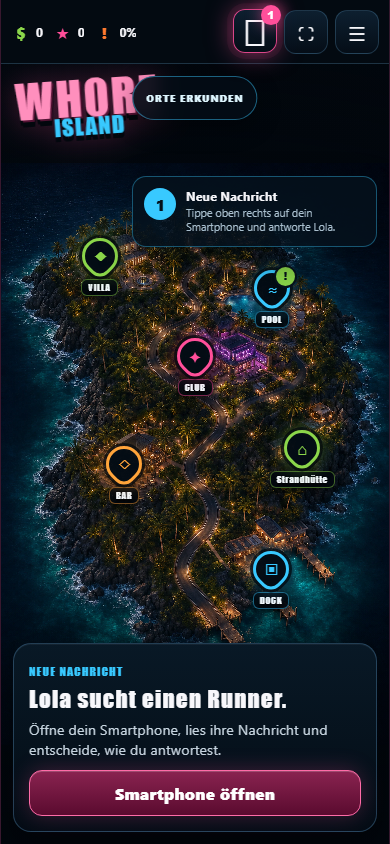
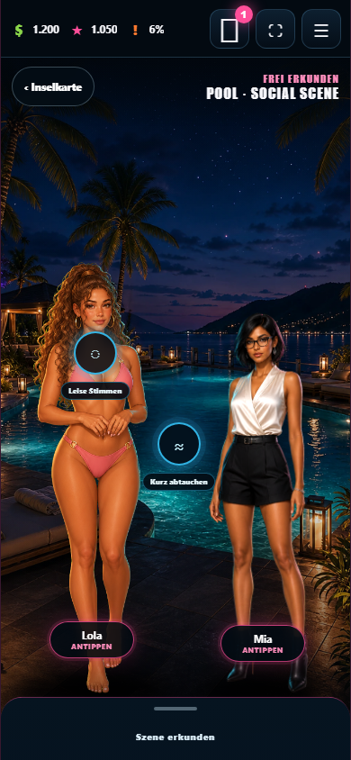

# Whore Island – Island Runner

Ein Mobile-First-HTML5-Spiel über Concierge-Aufträge, Fahrten, Beziehungen und Konsequenzen auf einer luxuriösen tropischen Insel.

**Live:** https://emfau88.github.io/island/

## Entwicklungsstand

Der spielbare Prototyp enthält drei Lola-Missionen, Mias ersten vollständigen Auftrag und eine persistente Anwesen-Progression von der Strandhütte bis zur Island-Villa. Die Insel ist die primäre Spielebene: Pool, Villa, Club, Bar, Service-Dock, Yacht-Dock und Runner-Home lassen sich direkt anwählen und über Story-Spots in der Kulisse erkunden. Am Pool stehen Figuren erstmals sichtbar in der Welt; Lola besitzt dort drei eigene Swimwear-Posen für neutrale, positive und ernste Gespräche. Entscheidungen schreiben persistente soziale Erinnerungen. Das Smartphone ist ein jederzeit schließbares Ingame-Werkzeug für Nachrichten, Antworten, Aufträge, Kontakte und ihr unterschiedliches Wissen – keine eigene Spielwelt.

Die Referenzmockups liegen ausschließlich unter `docs/references/` und werden nicht zur Laufzeit geladen.

## Einblicke

| Inselkarte | Pool-Social-Scene | Runner-Anwesen |
| --- | --- | --- |
|  |  |  |

## Lokale Entwicklung

```bash
npm install
npm run dev
```

Qualitätsprüfungen:

```bash
npm run test
npm run build
npm run test:e2e
npm run check
```

## Technik

- Vite und TypeScript
- ein persistenter PixiJS-8-Renderer für gemeinsame Weltkoordinaten, straßentreue Routen und Fahrzeug
- HTML/CSS für HUD, Dialoge und das Smartphone-Overlay
- datengetriebene Missionen, beantwortbare Nachrichten und soziale Erinnerungen
- persistente Ortsbesuche, einmalige Entdeckungen und ortsübergreifende Hinweis-Ketten
- komponierte Social Scenes mit Charakter-Layern, Hotspots und einklappbarer Interaktion
- Runner-Home als Social Hub mit ausbaubarem Midnight Wing
- Vitest für Save-, Progressions-, Transaktions- und Konsequenztests
- Playwright für Onboarding, Mobile-Flows, Reloads und Screenshots
- validierter und migrierbarer LocalStorage-Spielstand
- sichtbarer Economy-Sink mit Story-, Fan- und Cash-Voraussetzungen

## Spielprinzip

Eine Nachricht beantworten, einen Inselort aufsuchen und dort Personen oder Hinweise direkt im Bild entdecken. Gespräche, kleine Ortsaktionen und nur erzählerisch relevante Fahrten führen zu sichtbaren Konsequenzen. Zwischen Aufträgen werden Beziehungen gepflegt, Hinweise kombiniert und Runner-Vorbereitungen getroffen. Geld fließt ins Anwesen und in den geheimen Midnight Wing, wo Vertrauen, Regeln und Storyfortschritt neue private Szenen öffnen. Figuren kennen nur Ereignisse, die sie selbst erlebt oder von denen sie nachvollziehbar erfahren haben.

## Datenschutz

Das Spiel arbeitet vollständig lokal. Spielstände und Nachrichtenauswahl werden nicht an einen Server übertragen.
